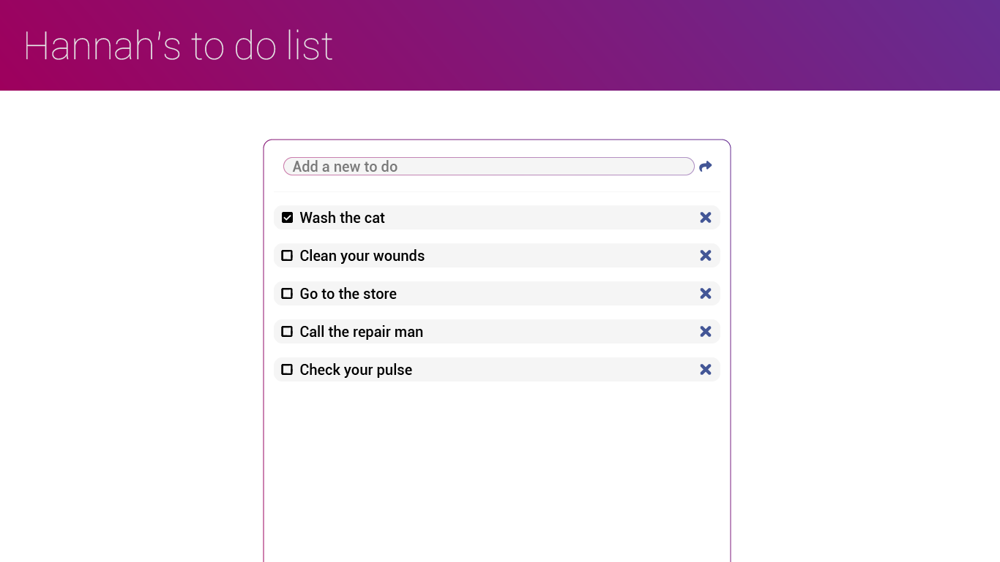
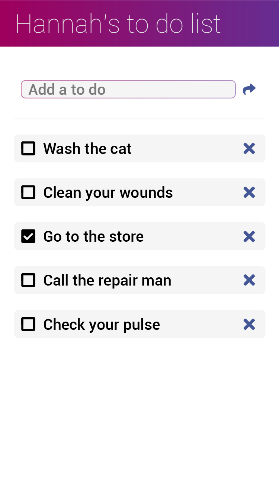

# Homework 6 - To Do List App, and Reading

There are **2 parts** to this homework. The homework is only complete if **all** parts are submitted.

Homework is only incomplete if 1 or more parts are not submitted. Non-working code is **not** an incomplete. Please turn in any code you have. 

**This homework is due Tuesday September 25th at 5pm.** Late submissions are not accepted.

## Part 1: To Do List Application

For the main part of this week's homework, you're going to be creating a to do list application using what we've learned in the last week: Node.js, Express and Express routes, and jQuery's AJAX method.

Create a to do list application that matches the mobile and desktop designs below:

You will need to use [Font Awesome](https://fontawesome.com/) for the icons. The font used is Roboto from Google Fonts. You will also need to include jQuery in your application.

### You need to meet the following requirements

- Use array methods instead of for loops
- Make a GET route for getting all todo list items
- Make a POST route for adding a new todo list item
- Make a DELETE route for deleting a todo list item using the X button next to it
- Make a PUT route for updating a todo list item when it is checked or unchecked
- Modularize your routes by seperating your Express routes into a seperate route file
- No global variables other than functions and state (front-end)
- Use a single render function to render items to the page (front-end)
- Use AJAX (part of the jQuery library) to make GET, POST, PUT, and DELETE requests from the front-end
- Deploy the final application to Heroku and submit **two** links: a Heroku link and your Github repo link

Next week we will be adding a database so that our to do entries will be stored even if the server application is reset.

---

## Part 2: Introduction to Mongo Reading

Read the following article: [The SQL vs NoSQL Difference: MySQL vs MongoDB](https://medium.com/xplenty-blog/the-sql-vs-nosql-difference-mysql-vs-mongodb-32c9980e67b2)

* You may need to read the article several times to fully understand it. 

* You may need to Google concepts that you don't fully understand. 

* When you fully understand the article, write a synopsis as though you are explaining the concepts to a ten year old. 

* Your summary must be at least 150 words.

* Your summary must include one analogy. Example "A conditional is like a fork in the road. You go one way if you want to go home and another if you want to go to work."